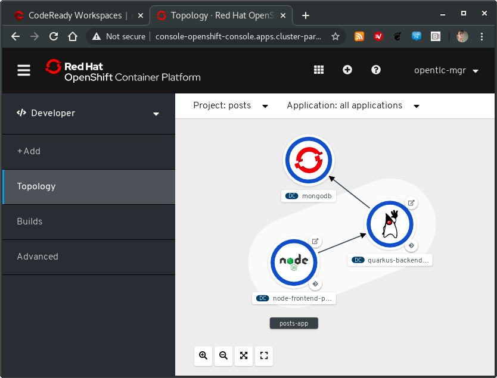
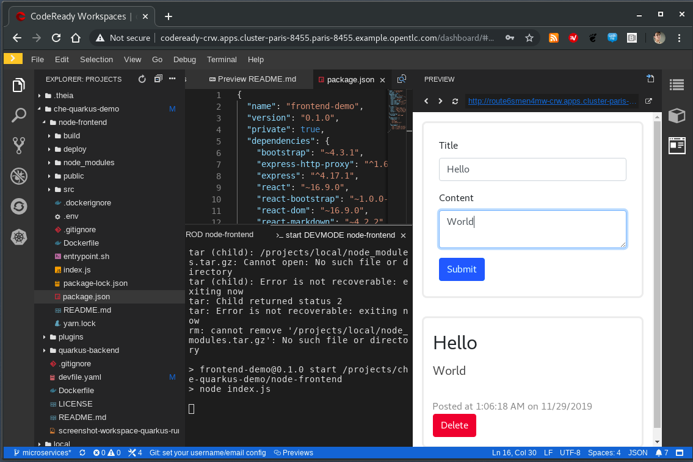

# The Cloud Ready Postit application
A Cloud ready Post it app composed of
- a Quarkus backend,
- a Nodejs/Reactjs frontend and
- a Mongodb database


To run this demo:

1. Add your prefered Che or CodeReady Workspaces instance: https://blog.sunix.org/factory 
2. Start the workspace: [](https://blog.sunix.org/factory?url=https://github.com/redhat-developer-demos/quarkus-reactjs-postit-app)

or

```
https://<your-codeready-workspaces-instance>/factory?url=https://github.com/redhat-developer-demos/quarkus-reactjs-postit-app
```





